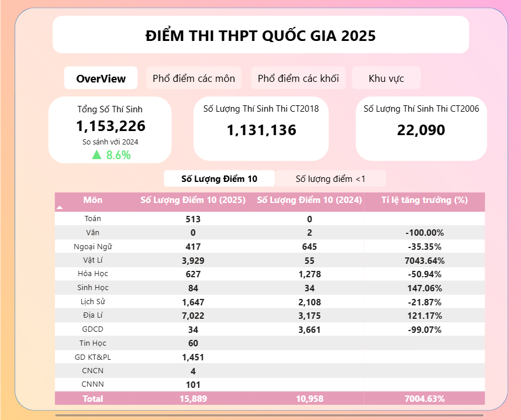

# 🎓 Phân Tích Điểm Thi THPT 2025

Dự án phân tích điểm thi THPT 2025 sử dụng Python để làm sạch và xử lý dữ liệu, tính điểm tổ hợp theo quy định, sau đó trực quan hóa bằng Power BI giúp đánh giá phân bố điểm theo môn, khối và khu vực, hỗ trợ học sinh định hướng xét tuyển, đồng thời cung cấp góc nhìn toàn diện về chất lượng giáo dục trên toàn quốc.

---

## 📌 Nguồn Dữ Liệu

- [Tra cứu điểm thi THPT Quốc gia 2025 (Bộ Giáo Dục)](https://tracuudiem.thitotnghiepthpt.edu.vn/)
- [Danh sách hội đồng thi (Báo Lao Động)](https://laodong.vn/giao-duc/bo-gddt-cong-bo-danh-sach-hoi-dong-thi-tot-nghiep-thpt-nam-2025-1500624.ldo)

---

## 🧠 Mục Tiêu Dự Án

- **Bức tranh tổng quan kỳ thi THPT 2025**
  - Đánh giá phân bố điểm thi của thí sinh theo từng môn học và từng khối thi.
  - Xác định xu hướng điểm cao/thấp, mức độ phân hóa theo môn học.
  
- **So sánh giữa các vùng/khu vực**
  - Phân tích sự chênh lệch điểm giữa các tỉnh thành, đánh giá tính công bằng trong giáo dục.

- **Hỗ trợ học sinh**
  - Cung cấp thông tin thực tế về phổ điểm giúp thí sinh định hướng nguyện vọng đại học phù hợp.

---

## 📂 Cấu Trúc Thư Mục
```
├── Data/
│ ├── Raw/ # Dữ liệu gốc chưa xử lý
│ └── Processed/ # Dữ liệu đã xử lý, tính tổ hợp
├── Python/ # Notebook Python làm sạch và phân tích dữ liệu
├── Screenshot/ # Biểu đồ phân tích xuất ra
│ ├── Tổng Quan/ # Biểu đồ thể hiện tổng quan kì thi thpt 2025
│ ├── Các Môn Thi/ # Biểu đồ phân tích các môn thi
│ ├── Khối A/ # Biểu đồ A00, A01,...
│ ├── Khối B/ # Biểu đồ B00, B02,...
│ ├── Khối C/ # Biểu đồ C00, C01,...
│ ├── Khối D/ # Biểu đồ D01, D07,...
│ └── Khu vực/ # Biểu đồ theo tỉnh/khu vực
├── DashBoard/ # File Dashboard Power BI
```

---


## 📊 Demo Biểu Đồ Phân Phối

Một số ví dụ biểu đồ phân phối điểm theo tổ hợp khối:

| Khối   | Biểu đồ minh họa                                       |
|--------|--------------------------------------------------------|
| Guideline    |  |
| OverView     |  |
| Khối A – A00 |  |
| Khối B – B00 |  |
| Khối C – C00 |  |
| Khối D – D01 |  |

📁 *Thư mục Screenshot chứa toàn bộ picture về tổng quan, từng môn, khối, khu vực.*

---

## 🛠 Công Nghệ Sử Dụng

- Python 3.11.9
- Pandas
- Jupyter Notebook
- Power BI
- Notion

---

## 📬 Liên Hệ

Dự án được thực hiện bởi **[@PhiHuynh-2212](https://github.com/PhiHuynh-2212)**  
👉 Facebook: [facebook.com/phihuynh2212](https://www.facebook.com/phihuynh2212)

---

## 📜 Giấy Phép
Dự án chia sẻ với mục đích học tập và cộng đồng.  
Vui lòng ghi nguồn khi sử dụng hoặc dẫn lại nội dung từ dự án này.

